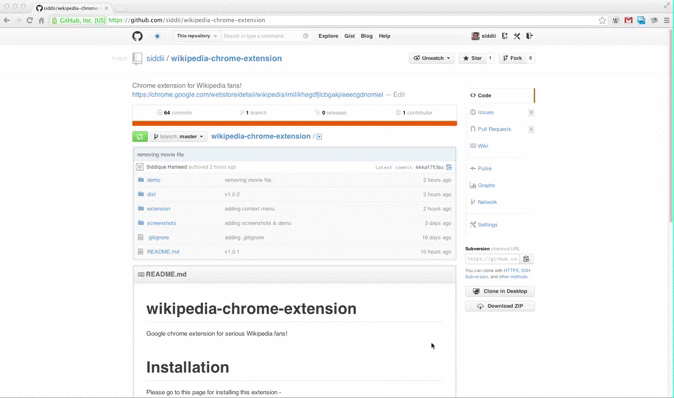

wikipedia-chrome-extension
==========================

Google chrome extension for serious Wikipedia fans!

# Installation
Please go to this page for installing this extension - https://chrome.google.com/webstore/detail/wikipedia/imilikhegdfjlcbgakjieeecgdnomiel

## Demo

## Version Notes
* 1.0.4
    * Added tab for Random Article
* 1.0.3
    * Added tabs for Wikimedia Commons picture & media

## Contribute

If you like to improve this extension, please submit <a
            href="https://github.com/siddii/wikipedia-chrome-extension/pulls" target="_new">pull request</a> or create <a
            href="https://github.com/siddii/wikipedia-chrome-extension/issues" target="_new">issue</a> to contribute to this
        project :)
